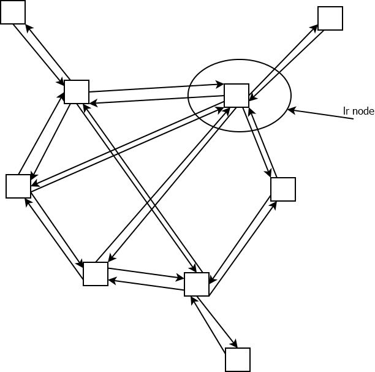

# lr

Generally in this framework, left side acts as server end, and right side as client end, shown as the picture below.

server is an example to use this application framwork.

usage:

  mkdir build
  
  cd build
  
  cmake ../
  
  make

# lr
thxuow
